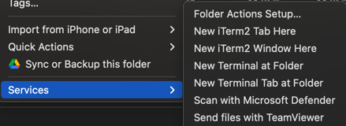
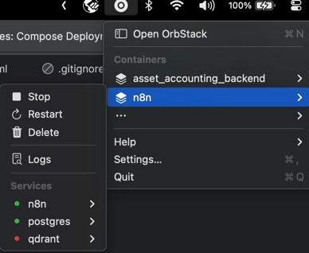

1. Download and Install https://orbstack.dev/

2. Download this code and unzip
   1. Code -> Local -> Download Zip
3. Click to folder n8n and New terminal at folder:
    1. 
4. Copy and parse this command:

 ```shell
docker-compose up -d
```
Wait for install

Go to: http://localhost:5678 and enjoy

You can start and stop n8n server by ui orbstack:

